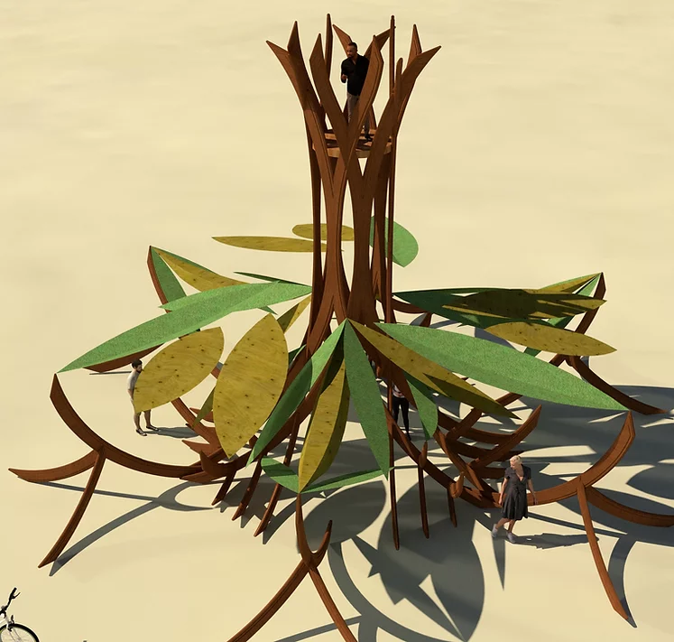

# Sirsasana

Sirsasana is a playful, welcoming 30 foot tall installation of a tree-like sculpture doing a headstand. Its tree roots reach for the sky, and its trunk is composed of interwoven wooden arcs based on the golden ratio that form a hyperboloid. Interactive lighting and soundscape brings the tree to life at night to display the pulsing, breathing flow of life force from roots to leaves as one would experience doing a headstand.

# Installation Guide
Windows 10 / Mac OS X / Linux
1. Get latest Advatek Assistant: https://www.advateklights.com/downloads/advatek-assistant/windows/V2.3.24
2. Get latest Maven: https://dlcdn.apache.org/maven/maven-3/3.8.4/binaries/apache-maven-3.8.4-bin.zip
3. Extract Maven Binary directory to User/Documents folder, add the path to Bin folder to the PATH environmental variable In System Properties
4. Get latest IntelliJ Community Edition:https://www.jetbrains.com/idea/download/download-thanks.html?platform=windows&code=IIC 
5. Get JDK 17: https://adoptium.net/
6. JAVA_HOME must be set for maven to compile succesfully. For example on Mac OS: tracyscott@TracyM1 Sirsasana % echo $JAVA_HOME
   /Library/Java/JavaVirtualMachines/temurin-17.jdk/Contents/Home
7. Add the path to Adoptium Java 17 bin folder to the PATH environmental variable In System Properties

8. Get GitHub Desktop: https://central.github.com/deployments/desktop/desktop/latest/win32
9. Clone the project Github Directory to a local directory: https://github.com/tracyscott/Sirsasana/
10. In Command Prompt, get to the directory of Sirsasana Github project and Run below mvn install commands (or run mvn_installs.sh):
11. mvn install:install-file -Dfile=lib/lx-0.4.1-SNAPSHOT-jar-with-dependencies.jar -DgroupId=heronarts -DartifactId=lx -Dversion=0.4.1-SNAPSHOT-jar-with-dependencies -Dpackaging=jar
12. mvn install:install-file -Dfile=lib/p4lx-0.4.1-SNAPSHOT.jar -DgroupId=heronarts -DartifactId=p4lx -Dversion=0.4.1-SNAPSHOT -Dpackaging=jar
13. mvn install:install-file -Dfile=lib/lxstudio-0.4.1-SNAPSHOT.jar -DgroupId=heronarts -DartifactId=lxstudio -Dversion=0.4.1-SNAPSHOT -Dpackaging=jar
14. mvn install:install-file -Dfile=classpath/core-4.0b8.jar -DgroupId=org.processing -DartifactId=core -Dversion=4.0b8 -Dpackaging=jar
15. mvn install:install-file -Dfile=classpath/jogl-all-4.0b8.jar -DgroupId=org.jogamp -DartifactId=jogl-all -Dversion=4.0b8 -Dpackaging=jar
16. mvn install:install-file -Dfile=classpath/gluegen-rt-4.0b8.jar -DgroupId=org.jogamp -DartifactId=gluegen-rt -Dversion=4.0b8 -Dpackaging=jar
17. mvn install:install-file -Dfile=lib/firmata4j-2.3.8-SNAPSHOT.jar -DgroupId=com.github.kurbatov -DartifactId=firmata4j -Dversion=2.3.8-SNAPSHOT -Dpackaging=jar
18. Processing 4 and JOGL have some native library issues.  We need to explicitly pass -Djava.library.path=build/library when running our executable where build/library is symlinked to the appropriate classpath/*architecture* directory
19. mkdir build
20. Mac OS M1: ln -hsf ../classpath/macos-aarch64 build/library
21. Mac OS Intel: ln -hsf ../classpath/macos-x86_64/ build/library
22. If on windows, mklink /d build\library ..\classpath\windows-amd64
23. mvn package
24. To run from the command line: java -Djava.library.path=build/library -jar target/sirsasana-0.4.1-jar-with-dependencies.jar
25. Create a new project in IntelliJ using the pom.xml file in the project directory
26. In the newly created IntelliJ project create a maven RUN config file enter compile exec:java -Djava.library.path=/Absolute/path/Sirsasana/build/library -Dexec.mainClass=art.lookingup.sirsasana.SirsasanaApp in Commannd Line field (needs to be tested for new native library issues)
27. Add an IntelliJ run configuration for generating the maven package. Create another Maven configuration and for the command just enter 'package'.
28. Add an IntelliJ run configuration for running the application jar.  Replace any referenced absolute path here with the equivalent on your system. Make sure to have a top-level element selected on the left and then click on '+'.  Choose Jar Application.  Select the target/sirsasana-0.4.1-jar-with-dependencies.jar as the application jar.  For VM options enter: -Djava.library.path=/Users/tracyscott/Documents/GitHub/Sirsasana/build/library
28. 
